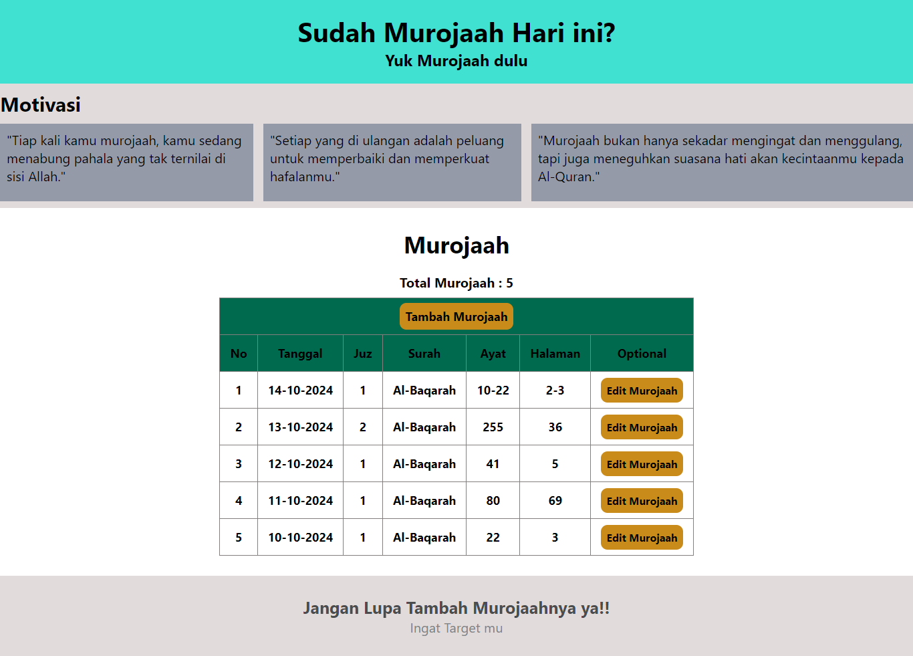
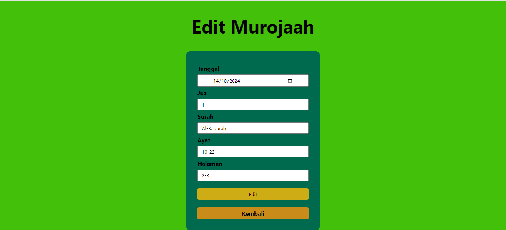
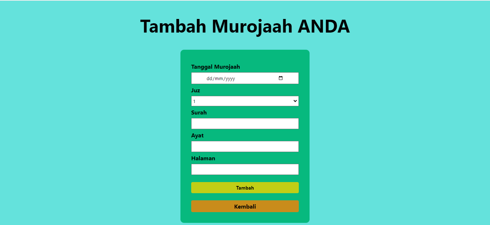

# Pencatatan Murojaah

Ini adalah Pencatatan **Murojaah** berbasis PHP yang dirancang untuk membantu pengguna dalam mencatat, mengelola, dan mengedit sesi murojaah (mengulang hafalan Al-Quran). Aplikasi ini memanfaatkan operasi **CRUD** (Create, Read, Update) dan menampilkan data dalam bentuk tabel yang mudah diakses.

## Fitur Utama

1. **Tinjau Data Murojaah (Read)**: Menampilkan daftar data murojaah yang telah dicatat dalam bentuk tabel.
2. **Tambah Murojaah (Create)**: Menyediakan form untuk menambahkan data murojaah baru.
3. **Edit Murojaah (Update)**: Memungkinkan pengguna untuk mengedit data murojaah yang sudah ada.
4. **Motivasi**: Menampilkan kutipan motivasi yang menginspirasi pengguna untuk terus murojaah.

## Struktur Proyek
- **`murojaah.php`**: Menampilkan daftar murojaah yang tersimpan.

### Tabel Murojaah
Tabel ini menampilkan data murojaah yang sudah tersimpan. Setiap baris tabel berisi:

Nomor: Nomor urut.
Tanggal: Tanggal murojaah dilakukan.
Juz: Juz yang diulang.
Surah: Surah yang diulang.
Ayat: Ayat yang diulang.
Halaman: Halaman di mushaf terkait ayat yang diulang.
Edit Murojaah: Tombol untuk mengedit data murojaah.
- **`tambah_murojaah.php`**: Form untuk menambahkan data murojaah baru.

- **`edit_murojaah.php`**: Halaman untuk mengedit data murojaah yang sudah ada.

